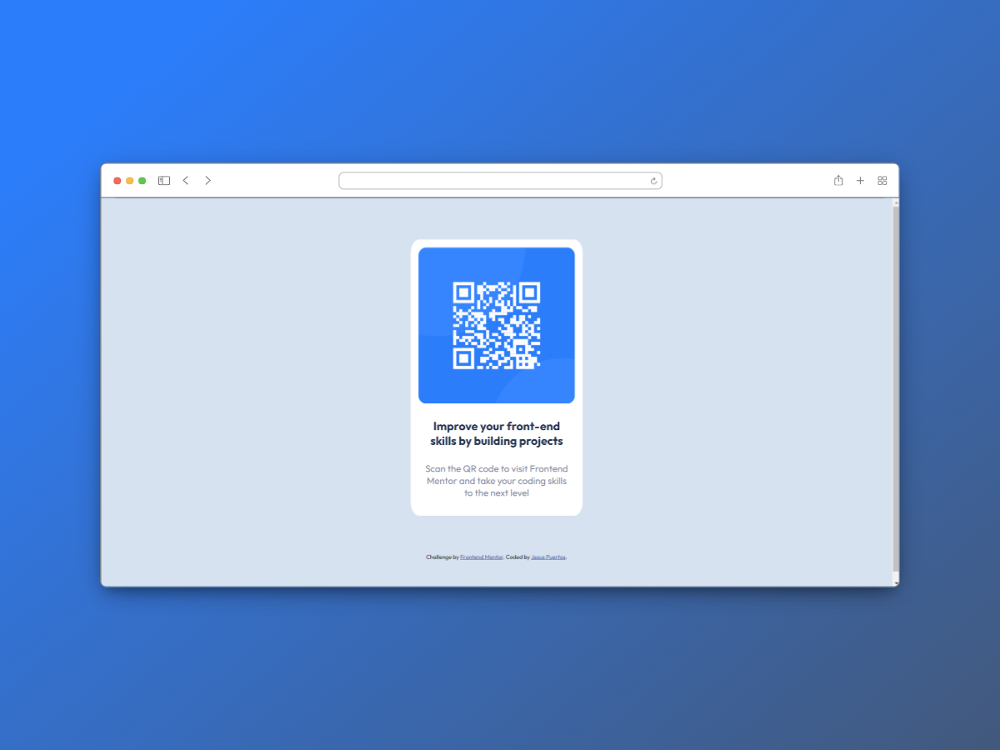

# Frontend Mentor - QR code component solution

This is a solution to the [QR code component challenge on Frontend Mentor](https://www.frontendmentor.io/challenges/qr-code-component-iux_sIO_H). Frontend Mentor challenges help you improve your coding skills by building realistic projects.

## Table of contents

- [Overview](#overview)

  - [Screenshot](#screenshot)
  - [Links](#links)

- [My process](#my-process)

  - [Built with](#built-with)
  - [What I learned](#what-i-learned)

- [Author](#author)

## Overview

### Screenshot



A

### Links

- Solution URL: [solution URL here](https://your-solution-url.com)
- Live Site URL: [live site URL here](https://your-live-site-url.com)

## My process

### Built with

- Semantic HTML5 markup
- CSS custom properties
- Flexbox

### What I learned

### What I Learned

During this project, I learned how to create a card using CSS and HTML. Here's the code I used:

```css
.container {
  display: flex;
  align-items: center;
  justify-content: center;
  height: 90vh;
  margin: 0;
}

.card {
  width: 33rem;
  height: auto;
  text-align: center;
  background-color: var(--White);
  border-radius: 5%;
  padding: 1.5rem;
}

.card__img img {
  max-width: 100%;
  border-radius: 5%;
}

.card__title {
  color: var(--Darkblue);
  font-size: 2.25rem;
  font-weight: var(--weight-700);
  text-align: center;
  padding: 1rem;
}

.card__description {
  font-size: 1.8rem;
  color: var(--Grayishblue);
  font-weight: var(--weight-400);
  padding: 0 1rem;
}
```

```HTML:

<main>
  <div class="container">
    <div class="card">
      <div class="card__img">
        
      </div>

      <h1 class="card__title">
        Improve your front-end skills by building projects
      </h1>

      <p class="card__description">
        Scan the QR code to visit Frontend Mentor and take your coding skills to the next level
      </p>
    </div>
  </div>
</main>
This is what I learned and applied in this project. The card I created has a centered design and uses CSS to style it.

```

## Author

- Website - [Jesus Puertos](https://jesus-puertos-portfolio.netlify.app/)
- Frontend Mentor - [@Jesus-Puertos](https://www.frontendmentor.io/profile/Jesus-Puertos)

```

```
